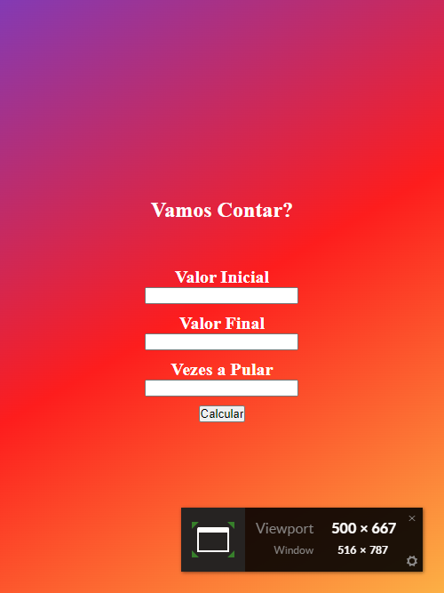
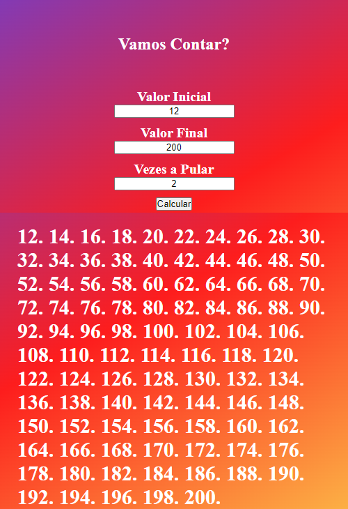
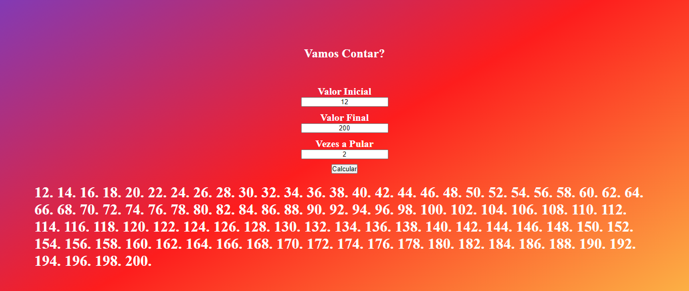

# *__Contador de numeros__*

    
    

 

>Um contador de números **inteiros** e números **reais**, simples de utilizar e de fácil leitura.

## **_Tecnologias_**

    
    
    

#

Para uso no desktop, no seu navegador de preferência.

#

## **_Uso no mobile_**

Com mesma funcionalidade e desempenho, mais facilidade para o uso em qualquer lugar.

    
    

#
## **_Desktop_**

>As funcões vão até a sua necessidade

#
## **_Licença_**
>MIT License &#169; zandrocr
